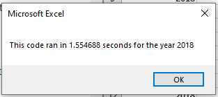
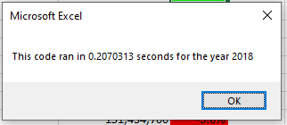

# Stock Analysis using VBA

## Overview of Project
Steve's parents would like to invest their money into a singular green energy stock, however, Steve would like them to have a more diversified portfolio of green energy stocks. To determine which stocks to recommend, he has collected data in Excel for twelve green energy stocks that he would like to analyze to draw conclusions on how well each one has performed. 

The stock data was analyzed for twelve green energy stocks for the years 2017 and 2018 to determine their total volume and yearly return. VBA was used to automate the analysis since the same analysis needed to be performed twice, once on a data set for the year 2017 and then again on a data set for the year 2018. 

Steve would like to be able to improve upon the code to be able to analyze thousands of stocks, as opposed to just the twelve he identified. This requires the VBA code to be refactored so the analysis will execute efficiently and in a timely manner.

### Purpose
The goal of refactoring the code was to write it in a way the code only had to loop through the data one time, as opposed to multiple times on a loop. 

The raw data and macro enabled Excel workbook and other associated files can be found here [Stock Analysis](https://github.com/RexBas90/stock-analysis).

## Results
The largest difference between the two VBA scripts was the original had a nested for loop whereas the refactored code did not and used multiple for loops instead.  

The original code performed an initialization step which set variables (ticker and totalVolume) for the inner for loop to execute on:

For i = 0 To 11
            
            ticker = tickers(i)
            totalVolume = 0 '

            *begin inner loop*

From the above duplicated code, it would clear out the totalVolume as well as set the ticker to a value in the array based on i. The inner loop would then loop through the rows for the specific ticker set in the outer loop. Then, it would run again, once the outer loop incremented the ticker until all the values in the ticker array had been evaluated for.  

In the refactored code, output arrays were created to store the data as opposed to reporting the outputs into the worksheet before being reused in the for loop again for each i. 

 '1b) Create three output arrays
    Dim tickerVolumes(12) As Long
    Dim tickerStartingPrices(12) As Single
    Dim tickerEndingPrices(12) As Single

The output values could then be reported all at once later, in its own for loop. 

For Z = 0 To 11
    
            Worksheets("All Stocks Analysis").Activate
            Cells(4 + Z, 1).Value = tickers(Z)
            Cells(4 + Z, 2).Value = tickerVolumes(Z)
            Cells(4 + Z, 3).Value = (tickerEndingPrices(Z) / tickerStartingPrices(Z)) - 1

    Next Z

The initialization of totalVolume output array was done in a for loop to itself before looping through the rows. 
 
 For i = 0 To 11
        
        tickerVolumes(i) = 0
        
    Next i

Then, the ticker was dynamically set within the second for loop, as opposed to being set by an outer loop. This allows for the for loop to loop through the rows only one time. 

 For j = 2 To RowCount

        '3a) Increase volume for current ticker
            If Cells(j, 1) = tickers(tickerIndex) Then

                tickerVolumes(tickerIndex) = tickerVolumes(tickerIndex) + Cells(j, 8).Value

            End If

        '3b) Check if the current row is the first row with the selected tickerIndex and set Starting Price

            If Cells(j - 1, 1).Value <> tickers(tickerIndex) And Cells(j, 1).Value = tickers(tickerIndex) Then

                        tickerStartingPrices(tickerIndex) = Cells(j, 6).Value
            End If

        '3c) check if the current row is the last row with the selected ticker and set Ending Price
         'If the next rows ticker doesn't match, increase the tickerIndex.
              If Cells(j + 1, 1).Value <> tickers(tickerIndex) And Cells(j, 1).Value = tickers(tickerIndex) Then
              
                       tickerEndingPrices(tickerIndex) = Cells(j, 6).Value
                    'increase ticker
                       tickerIndex = tickerIndex + 1
            End If

    Next j

Both VBA scripts, AllStocksAnalysis and AllStocksAnalysisRefactored, resulted in the exact same outputs, however, the execution time was different. The original executed in 1.55 seconds whereas the refactored code executed in 0.20 seconds. 

## Summary
1. The advantages of refactoring code is it allows for a more eloquent coding solution which can make the code easier to maintain and/or easier to be understood by others. The biggest advantage is it improves execution time, which becomes more important as data sets become larger. Disadvantages are it is time consuming process to do so since it requires more time to test to ensure the functionality remains the same and no new issues (i.e. bugs) have been created. 

2. It is evident that refactoring the code improved execution time, however, in order to ensure no new bugs have been introduced into the code, a larger set is required to fully test it. The code still has its limitations since it is only written to evaluate twelve stocks, and not thousands of stocks. 